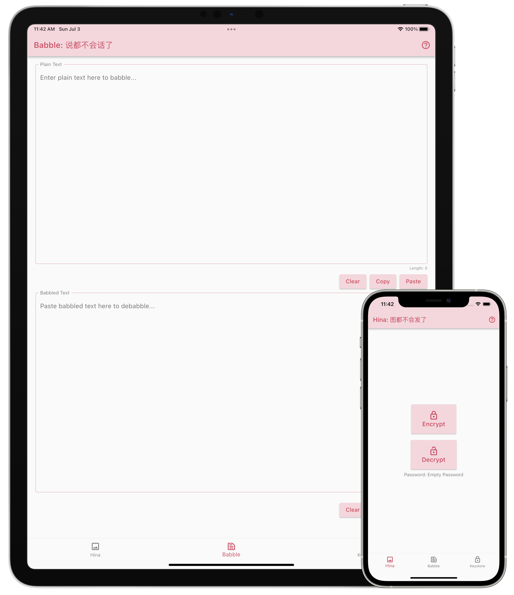

English • [简体中文](zh_CN.md)

The Babble app is a privacy tool designed for content creators and other Internet users who would like to protect their online contents or communications with others from unwanted AI/manual analysis and surveillance. It contains 2 components, Babble and Hina, to protect your text and image published online respectively.

Version 2.0.0:  

## Getting Started

Babble protects your article published online and your chatting with others by encrypting your content with a password. Only people who has the same password can decrypt and read your content. On the Babble page, you can enter the text you wish to encrypt into the upper text field, and the encrypted content will appear in the bottom text field. Conversely, you can paste encrypted content into the bottom text field to decrypt it.

Hina protects your images posted online or sent to others by encrypting them with a password (can be the same password you use for Babble). To encrypt or decrypt with Hina, tap on the respective button on the Hina page. After selecting an image, you'll have the chance to resize it and specify a block size before Hina does its work. If the decryption seems to have failed and you have made sure the password is correct, check to see if the author gave the correct image size and block size to decrypt the image.

The Keystore page is where you can manage your passwords and bases (see below for what bases are). You can select, add, edit, or delete passwords and bases in this page. There is also a key exchange functionality here. Follow the instructions in the key exchange dialog and you'll generate a shared password with another person without exposing what the password is.

## Practice

Try to decrypt the following content with empty password and the preset Emoji base:

> 🍗💕🦶🥔🍛💤🤪🍍🌮🍨🧓🐂👦🍬🐮😪💆🙊🦷🧂🦢🥤🐵🌾🥄😮🍳😸🥘🥨🍩🍔💘🦜🐃😳💌🦅🦴🍆🍕💟👱🏊🐠😉🐒🍊🍪🍀🍊🧓🍅😊🦴💦😇🐈🥪🍒🧊🥬😸💦🙉👃🍼🙈😲🍆

Try to decrypt the following image with empty password and the default block size:

## Technical Details

Babble encrypts your content via a state-of-art encryption algorithm. However, because posting encrypted content online is too obvious for a machine or human to detect (as it contains mainly gibberish), and the censors doesn't even need to know the content in order to block it from access, Babble also tries to encode your encrypted content wisely so that it is harder to detect. Currently, Babble supports encoding your content to a set of characters you define (we call it a "base"). The base has to be 256 unique characters. We provide 4 preset bases in Chinese, Japanese, Korean, and Emoji for your convenience/reference. The receiver has to use the exact same base to decode your content. To make the results less gibberish, you can also add characters which are not in your base to the resulting string to make it look more like a normal sentence. Babble will skip those characters when it decodes your content. This is still not perfect though. The resulting string might still reads gibberish, but it is harder to detect, especially when you are using a base in a language other than those used by the censors. A new feature is still under development. When it is done, you'll be able to use a machine learning model to encode the encyrpted content to an even more readable string.

Hina splits the image into a set of blocks of the size you specify, and transforms them randomly so the resulting image looks like random noise and you won't be able to know what's in the original image by looking at them. The block size can be decided by the user, which is a trade-off between security and image quality. The bigger the block size, the more information will be leaked in the resulting image, but the higher quality the decrypted image will be. We recommend using a block size of at least 8x8 to resist JPEG compression and at most 16x16 to avoid leaking to much information. In case the adversary resizes the image, you have the option to resize the image back to the original size before decryption, although the quality might be a bit worse.

## Privacy Policy

Babble doesn’t collect, share, or store any of your personal data.
