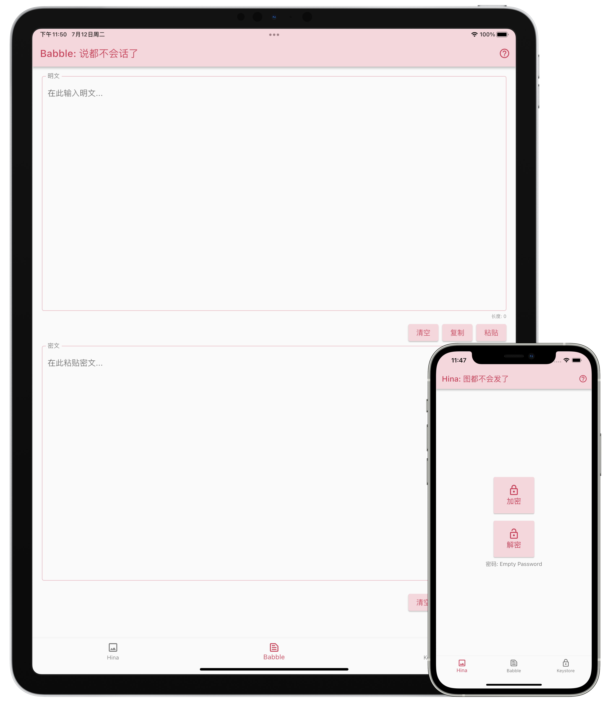

[English](/) • 简体中文

Babble App 是一款加密隐私工具，它能帮助你保护自己的博客、聊天软件中的文字和图片免受分析与监控。Babble App 拥有 Babble 和 Hina 两个功能，分别用来加密你在网上发表的文字和图片。

版本 2.0.0:  

## 入门教程

Babble 文字加密功能通过密码来保护你在网上发表的文字和聊天记录，加密之后，只有拥有相同密码的人才能解密获取内容。在 Babble 的界面上，顶部的文本框用来输入你想加密的文本；加密后的内容会自动出现在底部的文本框中。解密时，将加密后的内容粘贴到底部文本框中解密，即可获得原文。

Hina 图片加密功能也是用密码加密你在网上发布或发送给他人的图片，可以使用与文字加密相同的密码。使用 Hina 加密或解密图片只需点击页面上的相应按钮。如果密码正确但解密失败了，请核对加密和解密时的压缩度（即块的大小）是否一致；传输过程中的图片大小是否被更改，如果是，需要将图片大小改回加密图片的尺寸（解密界面可以更改尺寸）。

Keystore 页面可以用来管理你的密码和加密字符（关于加密字符的细节请见下文）。你可以在这个页面中选择、添加、编辑或删除密码和加密字符。Babble App 还支持密钥交换功能。在聊天过程中发送密码时，为了防止明文密码泄露给不相关的人，你们可以交换自己的公钥来生成一个共享密码。

## 练习

尝试使用空密码和预设的加密字符解密下列内容：

> 表正力飞场由很先量还五早服为所服面若容样记学放远得数面接留时全来五照样每尚件系下多空要子个注品事里至了尚得可怎年比那余照算若品题格门属尽收全区还物一它为结人白运最电水间区如星里世他然叫会已面定指算件心或到着给拉人笑听见听看二传书及才应表达全可备之式传往来光件程布他己并题式己结七食世说再面又

> 🤚🐃🌭🌭🥬🥒🥫🤽🦩💚👱🐨👩😍🖖🧀💫🍇🧇🏄👇🍨🍩🍐🍩🥯🕺🌷😍🦌😝😆🦌🍀🌱🥟😅🌾🍍😮🧀😅🍊🏄🍮🍔🥕🍜👃🐪🐵🦒🥮🐱🍜🕊💛🥘🧇🥑👷💝🐳🍊🥤🥒💞🍝😯👩😲🌾🥑🤩🍍🐳🐈🦡🌰😸🧊🧊🖖🌺🦉🦉🦊🍬🏄😂🍳😉😍🌰🐟🍩🥑💕🌮🍈🧔😅😝🧄🧔🦊🍭🤘🧅🦡👷

尝试使用空密码和默认块大小解密下列图片：

## 技术细节

Babble 使用先进的加密算法对内容进行加密。然而，由于在网上发布的加密内容通常看上去非常杂乱，这对机器或人类来说太明显了，审查员不需要知道内容就可以删除；因此，Babble 通过对你的加密内容进行更高级的编码，使它们更难被发现。目前，Babble 支持将内容编码为用户定义的一组字符（我们称之为“加密字符”）。加密字符必须是 256 个不相同的字符。我们提供四种预设加密字符，分别是中文、日文、韩文和 Emoji。接收者必须使用同一组加密字符来解码你的内容。为了使结果不那么杂乱，你也可以在产生的字符串中添加不在你的加密字符中的字符，使它看起来更像一个正常的句子。Babble 在对你的内容进行解码时，会跳过这些字符。但这还不是最优的解决方案：高级编码后的文字依然可能被发现，因为相对正常内容它还是比较杂乱，尤其是当你使用的字符是审查员所熟悉的语言时。为此，我们正在开发一个新的功能，使用机器学习模型将加密的内容编码为更可读的文字。

Hina 将图像分割成一组特定的大小的区块，并对它们进行随机变换，这样得到的图像看起来就像随机的噪音，你无法通过观察它们得知原始图像中的内容。块的大小称作压缩度，压缩度可以由用户决定，这是在安全和图像质量之间的权衡。块的大小越大，压缩度越低，产生的图像中泄露的信息就越多，但解密后的图像质量就越高。我们建议至少使用 8x8 的块大小来抵抗 JPEG 压缩，至多使用 16x16 的块大小来避免泄露太多信息。

## 隐私政策

Babble 不会收集、分享或储存你的任何个人数据。
